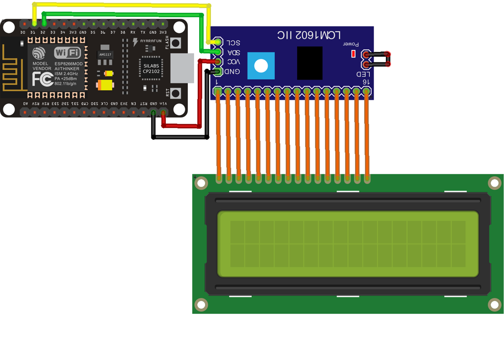

# The application shows messages sent by an http request on display

<!--  -->

  

## Requirements

* NodeMCU
* Display LCD 16×2
* Interface de I2C para Display LCD (16X2 / 20X4)
* IDE for development (https://www.arduino.cc/en/software)
* Check and install necessary libs
 <Wire.h>
 <WiFiClient.h>
 <ArduinoJson.h>
 <ESP8266WiFi.h>
 <ESP8266WebServer.h>
 <LiquidCrystal_I2C.h>

## Scheme

   